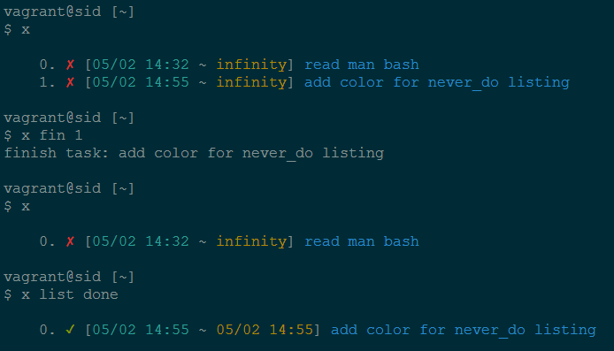

# NEVER DO

I will do it later usually means I will never do it, if you know what I mean.

## Spirit

Once, a little daemon inside my lazy body said to me in my dream:

> Neverdo is supposed to be simple, as you will never do it, why make it complex?
There is no `undo`, `remove`, `clear` or `search` support.
Make sure you really want to do it, then you can add a task, no `remove`.
Make sure you have finished one task, then you can `finish` it and never regret.
If you really want to `clear`, `vim ~/.neverdo/y` and hit `ggdG` should do it just fine.
If you really want to `search`, `x l | grep ...` should do it just fine.

## Installation

Add this line to your application's Gemfile:

```ruby
gem 'never_do'
```

And then execute:

    $ bundle

Or install it yourself as:

    $ gem install never_do

## Usage

The executable file is named `x`, todo file is `~/.neverdo/y`, done file is
`~/.neverdo/z`. The daemon loves math.

```
x a TASK     # add a task
x l          # list all unfinished tasks
x f ID       # finish one task
x e [yz]     # edit [xy]
x g [PATH]   # generate task log, like a summary, in markdown format
x h          # help
```

Everything after `x` starting with `a` is considered as add a task, thus
`x a ...` is the same as `x add ...`, the same for `l[ist]`, `f[inish]`,
`e[dit]`, `g[enerate]`, `h[elp]`.



## Contribute

If you find any bug, or have any question, please file an issue or make a pr,
I will appreciate it very much.

## License

MIT
